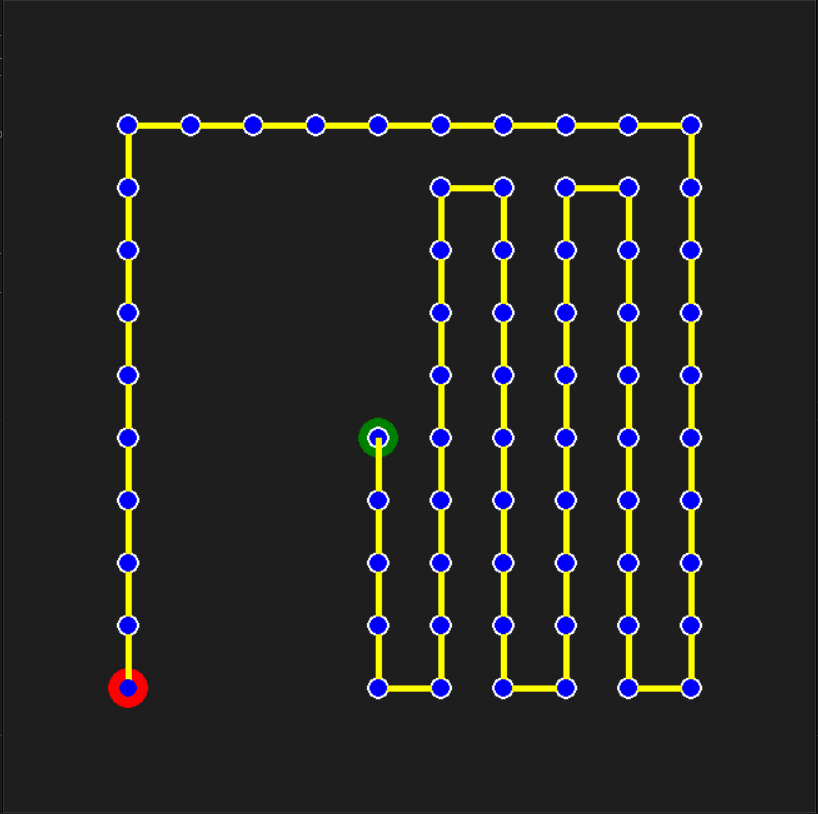
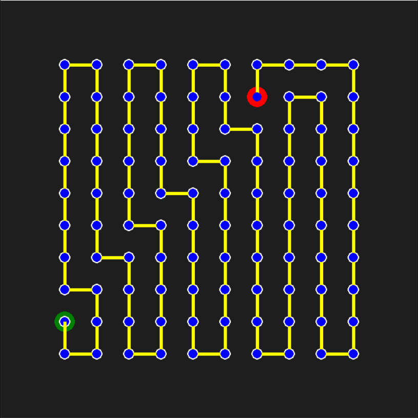
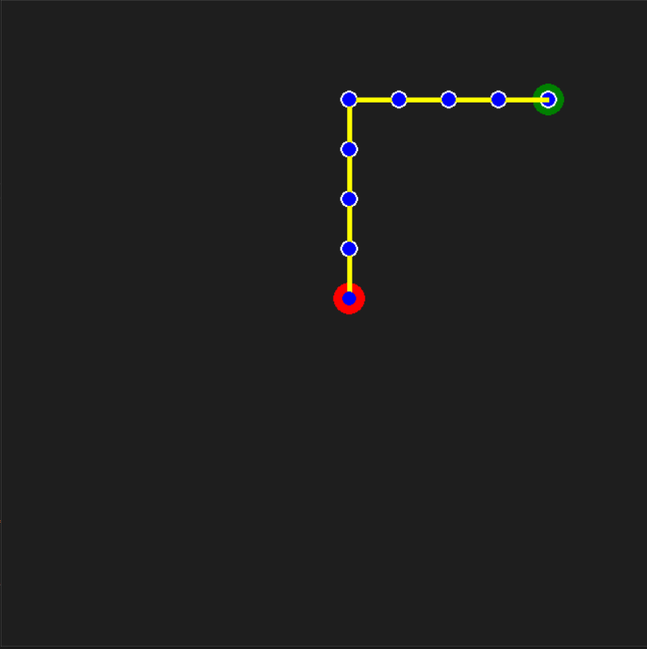
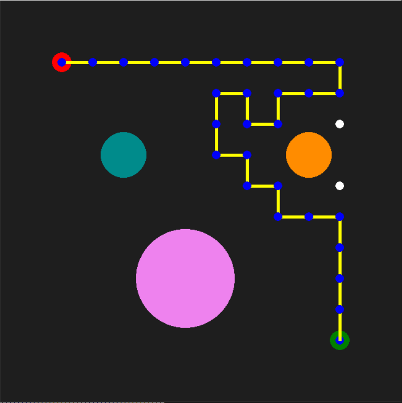
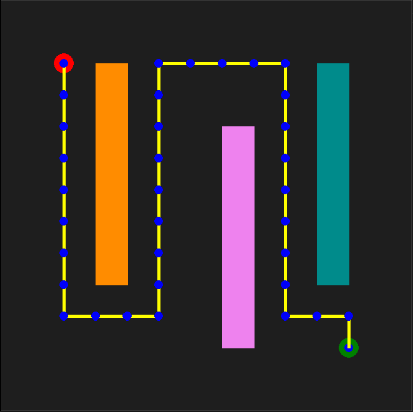
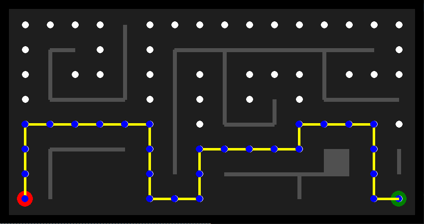

# Depth First Search [DFS] Algorithm

### Task:

Implement Breath First Search [DFS] algorithm on a map between a given start and goal node. The repository contains 2 files:

- **DFS_emptyMap.py** - The map is empty. The script finds DFS generated path between the two nodes.
- **DFS_obsMap.py** - The map has obstacles. The script finds the DFS generated path between the two nodes while avoiding obstacle space. The algorithm can be implemented on two maps.  Set the variable 'mapNumber' to 1 or to 2 in the main function to switch between maps.
- **DFS_Maze.py** -
        
### Path is visualized using pygame. 
- Start Node is Red
- Goal Node is Green
- Solution Path is in Blue/Yellow
- Explored Nodes are in White

### 4 action steps. Search Sequence: 

        Up --> Right --> Down --> Left

## Depth First Search 

### Tree Exploration Sequence: 

        

## Empty Map Results 

Start Node:(1,1) --> Goal Node:(5,5) |  Start Node:(7,9) --> Goal Node:(1,2)| Start Node:(6,6) --> Goal Node:(10,10)
:-------------------------:|:-------------------------:|:-------------------------:
  |  | 

## Obstacle Map Results 

Map 1: (1,10) --> (10,1)   |  Map 2: (1,10) --> (10,1) 
:-------------------------:|:-------------------------:
  |  

## Maze Map Results

        Start Node:(1,1) --> Goal Node:(16,1)

       

## Support
For any questions, email me at jaisharm@umd.edu
